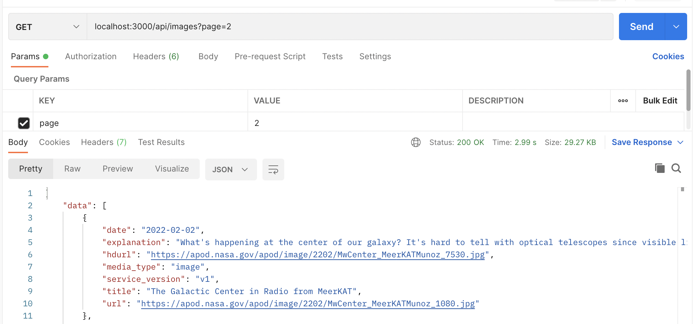

<h1> Technologies used </h1>
<ul>
  <li>Node</li>
  <li>Express</li>
  <li>Axios</li>
</ul>

<h1> How to run the project </h1>
1. <b>npm i</b> to install locally the dependencies  
2. <b>node index.js </b> to execute the server 

<h1> Usage </h1>
<b>Note: All of the endpoints ensure that the required "explanation", "hdurl", "title" and "url" fields are present in the JSON object returned as respponse<b>  
<h2>1. /api/images/?page=number_of_page </h2>

Return images from the NASA API in a given page - PAGINATION

number_of_page is the number of the page desired to retrieve from the NASA API.

  

Note: I wokred under the assumption that a page were all the pictures of a month of this year (2022) 
      1 = JANUARY 
      2 = FEBRUARY 
      3 = MARCH 
      4 = APRIL 
      5 = MAY
<h2>2.  /api/images/ultimas?fecha=2022-03-01 </h2>

Retrieves all the images in the NASA API since the specified date until the present day.

  
  
  
  <h2>3.  /api/images/atleast100 </h2>

Retrieves at least 100 images from the NASA API (from the first day of the year 2022 to the present day 

  
  
